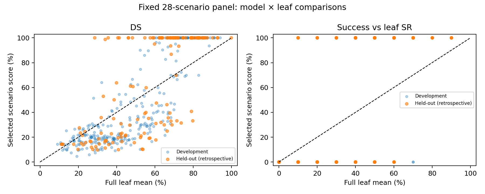

# 28 场景 proxy set：当前名单与 baseline 检查

## V-8 已完整，改用 28 个场景

2026-09-10 实时核对：16 个 learned models 加 PDM，在 seed0、seed1、seed1024 下均有 V-8 的 10/10 个有效评分文件（status=scored，DS 有限、success 为 0/1）。完整性证据见 [coverage.json](../v8_coverage_20260910/coverage.json)。完整不等于各 seed 运行条件相同；筛选统一使用 seed0。

已从全部 280 个场景、28 个 leaf（最细场景类别）中各选一个。原来的 27 个场景全部保留，新增 **V-8：`14c0a657ac3e5bb7`**。每个 leaf 有 10 个场景，代表场景权重为 1/28。本轮只检查已有无扰动评测中的代表性，没有运行 perturbation 或 GPU Job。

## 如何筛选

参考 [tinyBenchmarks §5](https://arxiv.org/html/2402.14992v2#S5)，将模型分成用于选场景的 development models 和不参与筛选、用于检验结果的 held-out models。沿用原有 11/5 划分；held-out 为 DrivoR、ReCogDrive IL/RL、SimWAM base/RL，其余 11 个学习模型负责筛选，PDM 不参与。具体名单见 [verification.json](verification.json)。最终 28 场景集合供所有模型共用。

参考 [tinyBenchmarks §3.2 Clustering](https://arxiv.org/html/2402.14992v2#S3.SS2)，用各 development model 的 DS/100 和 success 构造场景向量；同一模型家族有 n 个模型时，其坐标各除以 √n。在每个 leaf 内计算均值，再取离均值最近的真实场景，即 **leaf 内 k-means，k=1**。leaf 分层、双指标与 family 加权是我们的适配。不是全局 K=28，也没有重新做 joint search。

## 代表性检查

先检查固定集合；再轮流留出完整模型家族，只用其他家族重新选场景，检验筛选方法（family-out validation）。这是在 tinyBenchmarks model holdout 原则上的扩展；后者每轮场景可不同，不能当成同一固定集合的验证成绩。误差均以百分点计。

| 检查对象 | 整体 DS MAE | 整体 SR MAE |
|---|---:|---:|
| 固定 28 场景，所有模型（描述性） | 3.91 | 6.79 |
| 固定 28 场景，5 个 held-out models（回顾性） | 5.71 | 10.00 |
| 筛选方法，family-out validation | 3.33 | 5.49 |
| 每 leaf 随机一个，1,000 组均值 | 4.59 | 5.85 |

随机对照借鉴 [tinyBenchmarks §3.1](https://arxiv.org/html/2402.14992v2#S3.SS1) 的 stratified random sampling；重复次数为本任务设置。

**直接检查 leaf 内代表性**：对每个“模型 × leaf”，比较代表场景分数与该模型在该 leaf 的平均分，再平均绝对误差：

| 检查对象 | leaf 内 DS MAE | leaf 内 success/SR MAE |
|---|---:|---:|
| 固定集合，所有模型（描述性） | 19.32 | 26.74 |
| 固定集合，5 个 held-out models | 24.39 | 34.57 |
| 筛选方法，family-out validation | 21.21 | 28.08 |
| 分层随机，1,000 组均值 | 25.44 | 31.18 |

图中每个点是一个模型 × leaf。SR 图纵轴是单次 success（0/1），横轴是整个 leaf 的成功率；这种离散性本身限制了单场景对 leaf 平均 SR 的逼近。所有数字基于现有历史数据，不能当作全新盲测。

## 目前能说什么

**28 个 leaf 全覆盖已经满足；筛选方法的平均误差低于本次随机对照，但不足以认定每个代表场景都准确代表整个 leaf。** 整体误差较小可能掩盖不同 leaf 的误差相互抵消。论文应报告 leaf 内偏差，而不只报告整体分数。

场景类型和 inserted-actor 标记已导出，但尚未建立交通密度、道路几何或交互强度的完整属性对比，不能声称这些维度已验证。沿用此前完整场景分类；当前部分旧 metadata 与它不一致，15 项差异已记录在 [taxonomy_discrepancies.json](taxonomy_discrepancies.json)，未在本轮静默重分 leaf。历史 controller/renderer 条件差异仍适用。

## 文件

- [28 场景名单及权重](proxy_set.csv)；[纯 token 列表](proxy_tokens.txt)
- [逐 leaf 检查](leaf_diagnostics.csv)；[逐模型分数](model_scores.csv)
- [完整数值](verification.json)；[数据与约束检查](checks.json)
- [复现脚本](select28.py)；[本次评分快照](snapshot.json)；[场景 metadata](scenario_metadata.json)
