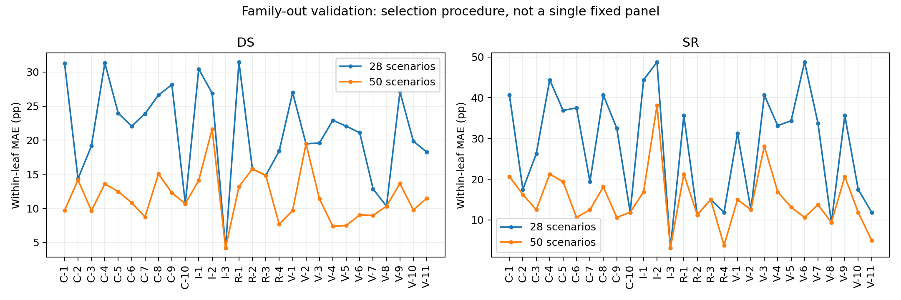

# 50 场景 proxy set：与 28 场景的比较

> Deadline 分批方案已准备：[优先 28 + 后补 22](staged_28_plus_22/README.md)。注意优先 28 是从这 50 个中选出的新集合，下文对比的“28”仍指旧集合。

## 结论

**扩到 50 个明显改善了平均 leaf 内代表性，但仍不能声称所有 leaf 都已充分代表。** 新名单已生成；当前作为候选保留，没有覆盖旧 28 场景名单。本次只使用已有无扰动评测结果和 CPU，没有运行 GPU 或 perturbation。

## 场景如何选

沿用完整 280 场景、28 个 leaf（最细场景类别），包括 V-8。参考 [tinyBenchmarks §5](https://arxiv.org/html/2402.14992v2#S5) 的 model holdout 原则：11 个 development models 用于选场景，5 个 held-out models 不参与筛选，只检验误差。具体划分沿用 28 场景版本，见 [verification.json](verification.json)。最终名单可供全部模型共用。

参考 [tinyBenchmarks §3.2 Clustering](https://arxiv.org/html/2402.14992v2#S3.SS2)，根据模型表现构造场景特征、聚类后选择离中心最近的真实场景。我们使用 DS/100 和 success（0/1）；同一模型家族有 n 个模型时，其坐标各除以 √n。

**新增的预算分配是我们自己的适配，不是 tinyBenchmarks 原算法**：每个 leaf 至少一个；分别尝试该 leaf 内不同的 k，计算用各 cluster 代表场景替代原场景后的特征平方误差，再用 dynamic programming 找到总数为 50、总误差最低的名额组合。它在已拟合的 k-means 方案中优化名额分配，不保证找到全局最优聚类。每次 k-means 使用固定 seed=9010、20 次初始化；分配不读取 held-out 模型结果。

不是给旧名单机械追加 22 个：获得多个名额的 leaf 会重新聚类。整体评分权重为 cluster_size/280；leaf 内评分权重为 cluster_size/leaf_size，不能对 50 个场景直接等权平均。

最终分配：C-5、V-1 各 3 个；C-7、C-10、I-2、I-3、R-2、R-3、V-2、V-8 各 1 个；其余 18 个 leaf 各 2 个。

## 验证：固定集合与筛选方法分开看

**固定集合**：比较原 28 场景和新 50 场景在那 5 个 held-out models 上的误差。这些模型结果之前已经被查看过，属于 retrospective validation，不是新的盲测。MAE 为平均绝对误差，单位为百分点。

| 固定集合的 held-out 检查 | 28 场景 | 50 场景 |
|---|---:|---:|
| leaf 内 DS MAE | 24.39 | **15.39** |
| leaf 内 SR MAE | 34.57 | **21.21** |
| 整体 DS MAE | 5.71 | **2.59** |
| 整体 SR MAE | 10.00 | **2.36** |

**筛选方法**：在 tinyBenchmarks 的 model holdout 原则上，增加 leave-one-family-out validation：每次留出整个模型家族，其余家族重新分配名额并选场景。不同轮的集合可以不同，下面不是同一个固定 50 场景集合的分数。

随机对照参考 [tinyBenchmarks §3.1](https://arxiv.org/html/2402.14992v2#S3.SS1) 的 stratified random sampling：沿用每轮 50 场景方案的各 leaf 名额，在 leaf 内随机无放回抽取，重复 1,000 组，随机样本在 leaf 内等权汇总。因此可以区分“增加预算”与“聚类选代表”的收益。

| family-out 检查 | 28 场景 | 50 场景 | 同名额随机 50 场景均值 |
|---|---:|---:|---:|
| leaf 内 DS MAE | 21.21 | **11.69** | 17.45 |
| leaf 内 SR MAE | 28.08 | **15.00** | 20.41 |
| 整体 DS MAE | 3.33 | **2.25** | 3.29 |
| 整体 SR MAE | 5.49 | 4.24 | **4.15** |

leaf 内误差指每个“模型 × leaf”的估计分数与完整 leaf 平均分的差，再平均绝对值。50 场景的 family-out leaf 内 DS/SR MAE 分别下降约 45%/47%；整体 SR 误差没有优于随机对照。

我们额外按 family 做 paired bootstrap：50−28 的 leaf 内 DS/SR MAE 差值，其近似 95% 区间分别为 [−10.60, −8.18] / [−15.22, −10.12] 个百分点，支持本次平均改善。该区间假设 families 可交换，不是对所有未来模型或每个 leaf 的保证。

## 仍然存在的问题

- **固定集合的 V-2 仍只有一个场景**：在 held-out models 上，DS/SR 的 leaf 内 MAE 为 49.29/68.00 个百分点，与 28 场景时相同。这说明按 development 模型分配名额仍可能漏掉 held-out 模型的困难 leaf。
- 固定集合在 5 个 held-out models 上的 DS 排名相关性（Spearman ρ）从 0.90 降到 0.60，SR 为 1.00；分数更准不自动意味着所有排名更准。
- 50 场景改善的是平均表现，不能据此称每个 leaf 都充分代表。没有通过调低阈值宣布“合格”，也没有根据上述 held-out 结果再次修改名额。
- 沿用 28 场景版本的分类口径、历史运行条件和 metadata 限制；本轮没有新增交通密度、几何或交互属性验证。

## 文件与复现

- [50 场景名单与权重](proxy_set.csv)；[token 列表](proxy_tokens.txt)；[cluster 成员](proxy_set.json)
- [完整结果](verification.json)；[逐 leaf 对比](leaf_comparison.csv)；[实验配置](PROTOCOL.json)
- [检查结果](checks.json)：50 个唯一场景、28 leaf 覆盖、cluster 完整划分 280 场景、权重和为 1、复现旧 28 名单、修改 held-out 数据不改变选集。
- [CPU 脚本](select50.py)。运行位置：`cogrob/horuan-nexussim`，container=`nexussim-container`，工作目录 `/hugsim-storage/NexusSim`，Python=`/root/nexussim-venv/bin/python`；命令：`/root/nexussim-venv/bin/python docs/experiments/proxy_verification_20260909/proxy50_20260910/select50.py`。
